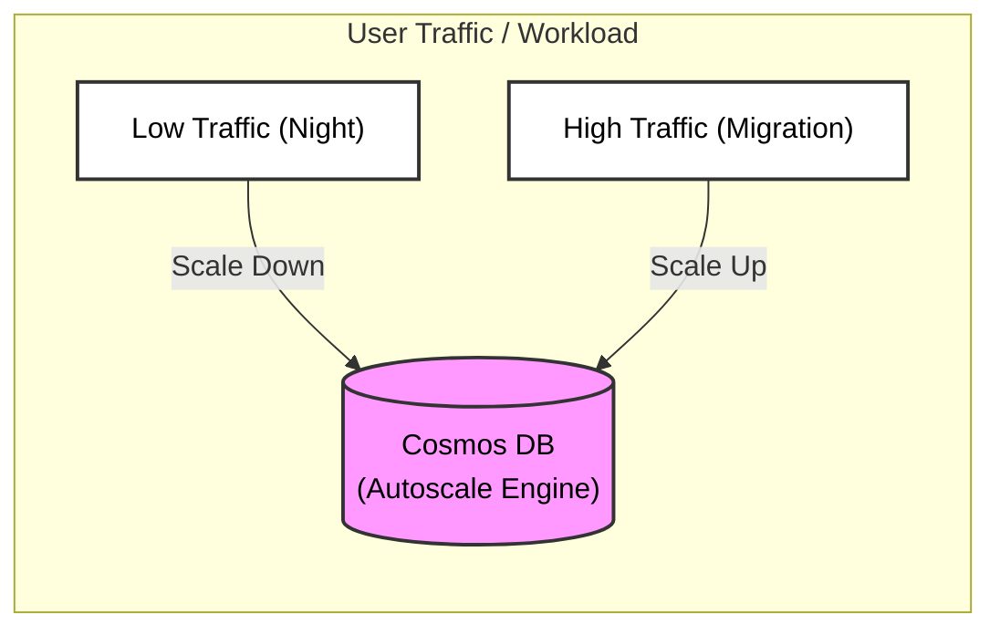
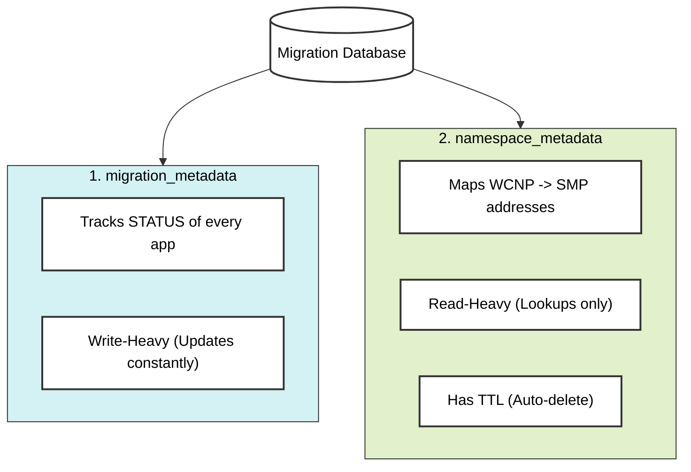
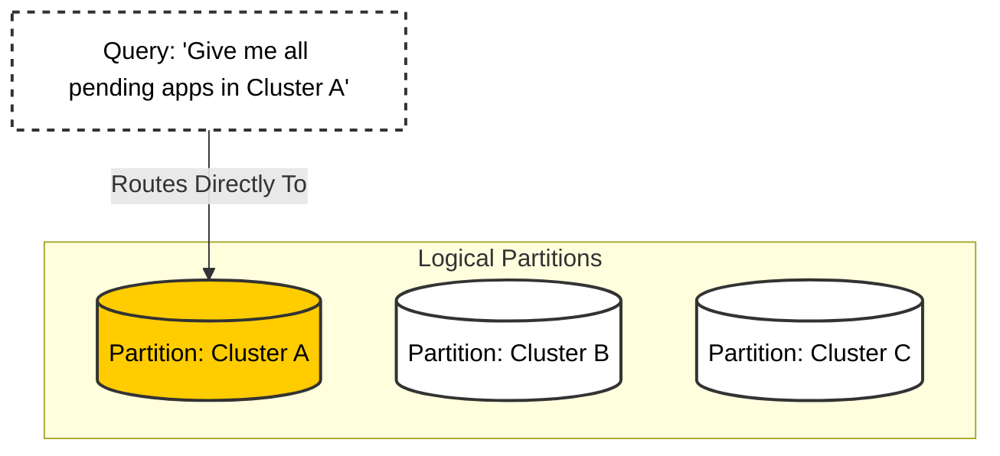
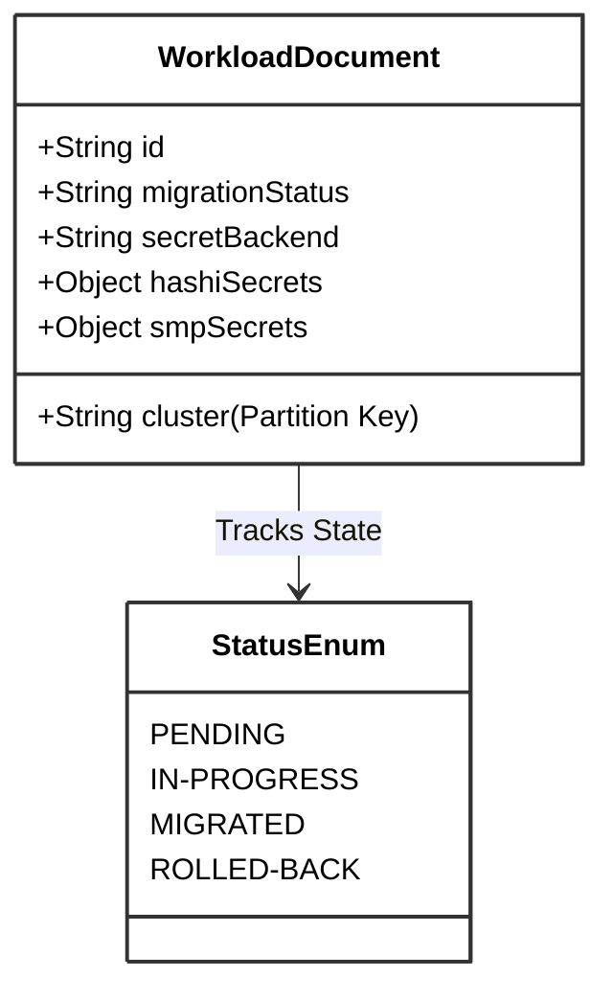
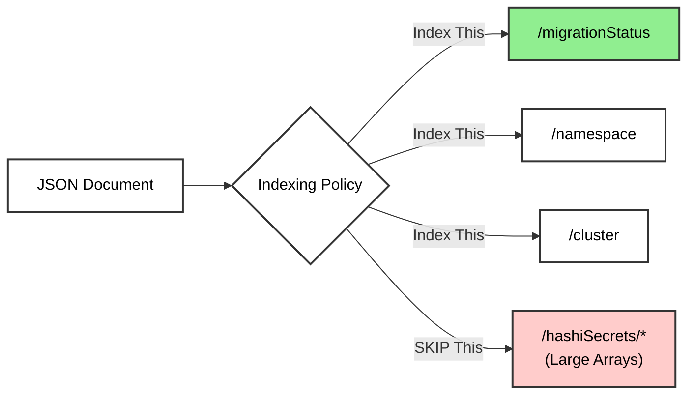
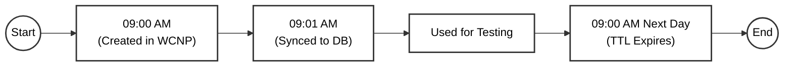

# CosmosDB Schema: The Deep Dive Explanation

**Purpose:** This document provides a detailed, point-by-point explanation of our CosmosDB schema design. It includes visual diagrams and "Speaker Notes" to help you explain the _Why_ and _How_ to your team.

---

## 1. Database Overview

### The Concept

We are using **Azure Cosmos DB** (NoSQL). Unlike a traditional SQL database (rows and columns), Cosmos DB stores data as **JSON Documents**. This gives us the flexibility to store complex, nested data (like secret paths) without complicated joins.

### Throughput Strategy: Autoscale

We chose **Autoscale** throughput.

> **Speaker Notes:**
>
> - "We selected **Autoscale** because our migration workload will be 'bursty'.
> - When we run a big batch migration, the database automatically revs up to 4,000 RU/s to handle the load.
> - At night, when nothing is happening, it scales down to the minimum (400 RU/s) to save money. We don't have to manually manage capacity."

---

## 2. Container Strategy

We separated our data into two distinct containers (like tables in SQL).

> **Speaker Notes:**
>
> - "We didn't dump everything into one bucket. We separated concerns."
> - "**`migration_metadata`** is our 'State Machine'. It changes constantly as apps move from 'Pending' to 'Migrated'."
> - "**`namespace_metadata`** is our 'Reference Library'. It's mostly static and used for lookups. Separating them allows us to tune performance independently."

---

## 3. Partitioning Strategy (`/cluster`)

This is the most critical design decision. We partition by **Cluster**.

> **Speaker Notes:**
>
> - "Cosmos DB needs to know how to group data physically. We chose **Cluster Name** as the grouping key."
> - "**Why?** Because our automation (the Scanner and Orchestrator) works one cluster at a time."
> - "This makes our queries incredibly fast and cheap because the database knows exactly which 'bucket' to look in. It doesn't have to search the whole world."

### Deep Dive: Why NOT Partition by `/namespace`?

You might ask: _"Since we look up namespaces often, why not partition by Namespace?"_

Here is the comparison:

| Feature              | Partition by `/cluster` (Our Choice)                                                                                     | Partition by `/namespace` (The Alternative)                                                                            |
| :------------------- | :----------------------------------------------------------------------------------------------------------------------- | :--------------------------------------------------------------------------------------------------------------------- |
| **Batch Processing** | ✅ **Fast & Cheap.** When the Orchestrator asks _"Give me all pending apps in Cluster A"_, it goes to **ONE** partition. | ❌ **Slow & Expensive.** The DB has to search **EVERY** partition (Fan-out query) to find apps belonging to Cluster A. |
| **Single Lookup**    | ✅ **Fast.** We usually know the cluster (e.g., `wcnp-prod-01:my-namespace`).                                            | ✅ **Fast.** Direct lookup by ID.                                                                                      |
| **Cost**             | 💰 **Low.** Most operations are single-partition.                                                                        | 💸 **High.** Every batch scan burns RUs checking thousands of partitions.                                              |

**The Verdict:**
Since our "Mover Bot" works by scanning entire clusters at a time, partitioning by `/cluster` is the only scalable option. If we used `/namespace`, our daily sync jobs would be incredibly slow and expensive.

---

## 4. The `migration_metadata` Schema

This is the document that tracks an app's journey.

### Visual Structure

### Key Fields Explained

1.  **`id` (Composite Key):** `cluster:namespace:workloadName`
    - _Explanation:_ "We combine these three fields to guarantee that every ID is unique across the entire universe. No collisions."
2.  **`migrationStatus`:**
    - _Explanation:_ "This is the heartbeat of the migration. The Orchestrator watches this field. If it says 'Pending', it wakes up and does work."
3.  **`secretBackend` (`hashi` vs `smp`):**
    - _Explanation:_ "This is the switch. If we set this to `smp`, the app gets new secrets. If we set it to `hashi`, it goes back to the old ones. This enables our **Instant Rollback** capability."

---

## 5. Indexing Policy (Performance Tuning)

We customized the indexing to save costs.

> **Speaker Notes:**
>
> - "By default, Cosmos DB indexes _everything_. That's expensive for write operations."
> - "We explicitly **Excluded** the `secrets` arrays from the index."
> - "**Why?** Because we never run queries like 'Find me all apps that have a secret named _password_'. We only query by Status or Name. Excluding the heavy data makes our writes faster and cheaper."

---

## 6. The `namespace_metadata` Schema (The Cache)

### The TTL Feature

> **Speaker Notes:**
>
> - "WCNP creates lots of temporary namespaces for testing. We don't want to keep them forever."
> - "We use a feature called **TTL (Time-To-Live)**. We set it to 24 hours."
> - "The database automatically deletes these records when the timer runs out. It's like a self-cleaning oven."

---

## Summary Checklist for Presentation

- [ ] **Scalability:** "It scales automatically with Autoscale."
- [ ] **Performance:** "Partitioning by Cluster makes our batch jobs instant."
- [ ] **Cost:** "Custom indexing and TTL save us money on storage and processing."
- [ ] **Safety:** "Separating the 'State Machine' from the 'Cache' ensures stability."
